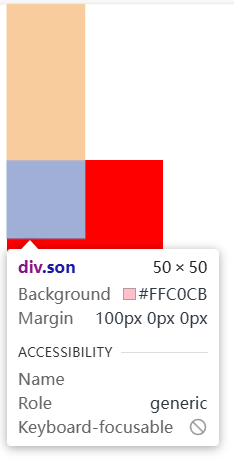

## 外边距合并

1. 父子元素嵌套
当父子元素嵌套且都设置了外边距，如margin-top，如果子元素的外边距大于父元素的外边距，那么子元素不会产生相对于父元素的外边距，而是父元素的外边距变成子元素的外边距的效果

解决方案：

- 设置一个透明的外边框
- 设置内边距
- overflow：hidden

2. 兄弟元素外边距合并

当两个元素都是兄弟元素都处于文档流中时，一个设置margin-bottom，一个设置margin-top，他们两个的间距会取margin-top>margin-bottom?margin-top:margin-bottom

解决方案：

- 只设置一个外边距（推荐）
- 使其中一个脱离文档流
